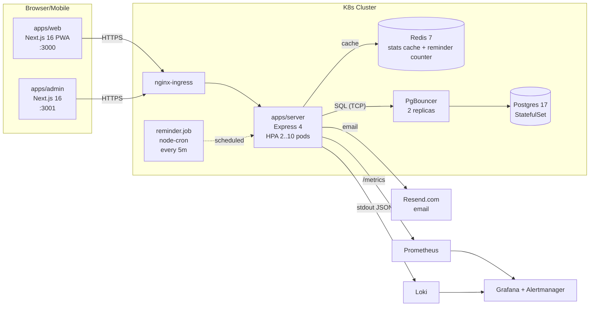

# 護你安 — Architecture Overview

## High-level system

## Application architecture

Single Express service. Three frontends. Postgres-only durability, Redis only
for hot reads. SSE channels run on regular HTTP connections (no WebSocket).

### Services / routes

| Service surface         | Routes (prefix)                          | Auth                |
|-------------------------|------------------------------------------|---------------------|
| Health + Prometheus     | `/api/health`, `/metrics`                | none                |
| User auth               | `/api/auth/login`, `/logout`, `/me`      | JWT cookie/Bearer   |
| Admin auth              | `/api/admin/auth/login`, `/logout`, `/me`| `X-Admin-Session`   |
| Events                  | `/api/events*`                            | JWT or admin        |
| Reports                 | `/api/events/:id/report(s)`              | JWT (own/team)      |
| Stats                   | `/api/events/:id/stats`, `/unreported`    | JWT or admin        |
| Manager                 | `/api/manager/team*`                      | JWT manager         |
| Users (admin)           | `/api/users*`                             | admin               |
| Departments             | `/api/departments*`                       | JWT (read), admin (write) |
| SSE                     | `/api/sse`                                | JWT or admin (cookie) |

### Key design decisions

| Decision                       | Why                                                                 |
|--------------------------------|---------------------------------------------------------------------|
| Single Postgres + Drizzle ORM  | Simpler than a microservice mesh; tx upsert is atomic per report.   |
| Recursive CTE on `manager_id`  | Org chart belongs in the database, not a graph store.               |
| SSE over WebSocket             | One-way push fits stats/alerts; no sticky sessions needed in K8s.   |
| Redis 3s TTL on stats          | Smooths the thundering herd when 1k users hit the dashboard.        |
| `(event_id, user_id)` unique idx | Makes `INSERT … ON CONFLICT DO UPDATE` atomic and idempotent.     |
| In-memory admin session Map    | OK for one server pod; for multi-pod we'd swap to Redis (Phase 2).  |
| Rewrite via Next.js `/api/*`   | Same-origin cookie flow without CORS gymnastics.                    |

## 12-Factor mapping

| Factor              | How                                                                  |
|---------------------|----------------------------------------------------------------------|
| I. Codebase         | Single git monorepo (`apps/*`, `packages/*`).                       |
| II. Dependencies    | `package.json` + Bun lockfile; Docker pinned to `bun@1.3.9`.        |
| III. Config         | All via env (`DATABASE_URL`, `JWT_SECRET`, `REDIS_URL`, …) — none in code. |
| IV. Backing services | Postgres/Redis/Resend addressed by URL; swappable per env.          |
| V. Build/release/run | `bun run build` → Docker image → K8s Deployment. Tag = commit SHA. |
| VI. Processes       | Stateless server pods; admin session map is the only in-mem state. |
| VII. Port binding    | Server :4000, web :3000, admin :3001 — exposed to ingress.        |
| VIII. Concurrency   | HPA scales 2→10 pods on CPU.                                        |
| IX. Disposability   | Liveness/readiness/startup probes, graceful SIGTERM handler.       |
| X. Dev/prod parity   | Same `docker-compose.yml` topology as the K8s topology.             |
| XI. Logs            | Pino JSON to stdout; Promtail → Loki.                               |
| XII. Admin processes| `db-migrate` Job; one-shot `seed` script.                          |

## High-availability story

| Concern              | Mitigation                                                          |
|----------------------|----------------------------------------------------------------------|
| Server pod crash     | `replicas: 2`, RollingUpdate `maxUnavailable: 0`, PDB `minAvailable: 1` |
| Postgres failure     | StatefulSet + PVC (single replica in MVP; Multi-AZ planned for Phase 2) |
| Redis outage         | Stats endpoint falls back to direct SQL (best-effort cache).         |
| Resend outage        | Reminders still fire via SSE; emails are best-effort.                |
| Burst traffic        | HPA + PgBouncer transaction pooling + 3s stats cache.                |
| Need-help fan-out    | Server-side computed manager chain; O(n) for n = users in event.    |

See `docs/sequences/` for per-flow diagrams.
