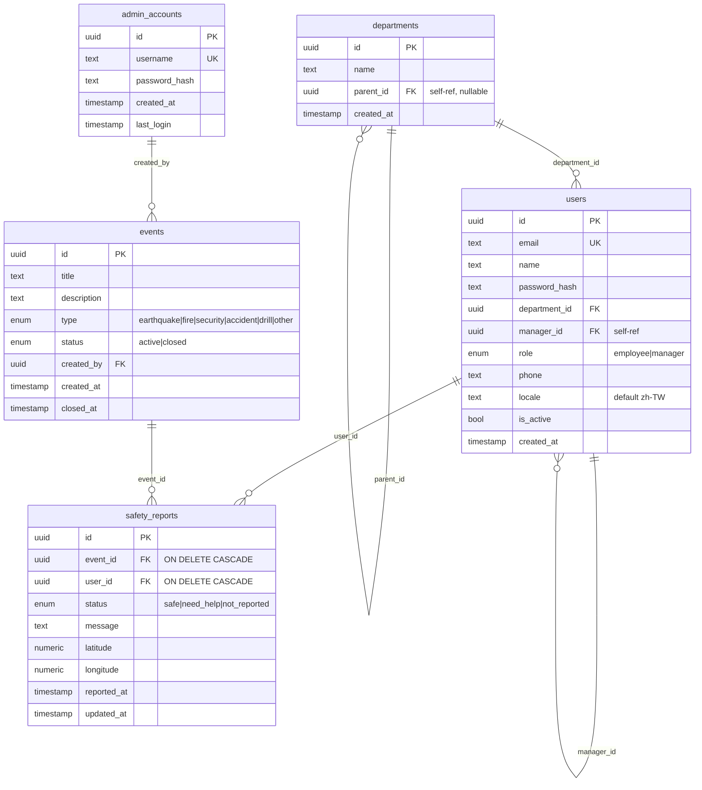

# Entity-Relationship — `safetydb`

## Key indexes

| Index                                       | Purpose                                         |
|---------------------------------------------|-------------------------------------------------|
| `users.email` UNIQUE                        | login lookup                                    |
| `admin_accounts.username` UNIQUE            | admin login lookup                              |
| `safety_reports (event_id, user_id)` UNIQUE | enables `ON CONFLICT DO UPDATE` upsert          |
| `departments.parent_id`                     | recursive CTE for the org tree                  |
| `users.manager_id`                          | recursive CTE for subordinate lookups           |

## Cascade rules

- Deleting an `event` cascades to its `safety_reports`.
- Deleting a `user` cascades to their `safety_reports`. (Soft delete via
  `is_active = false` is preferred in production; CASCADE is a safety net.)
- Departments are not cascade-deleted — DELETE is rejected if children or
  users still reference them.

## Source of truth

Schema lives in `packages/database/src/schema/*.ts` (Drizzle).
Migrations are generated via `bun run --filter database db:generate` and
committed under `packages/database/drizzle/*.sql`.
