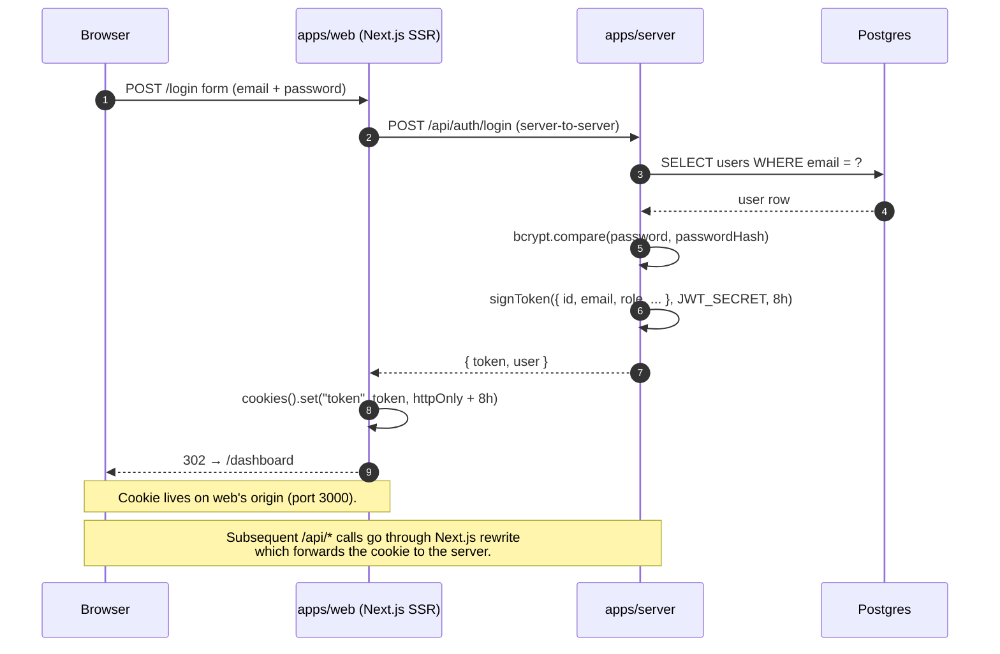
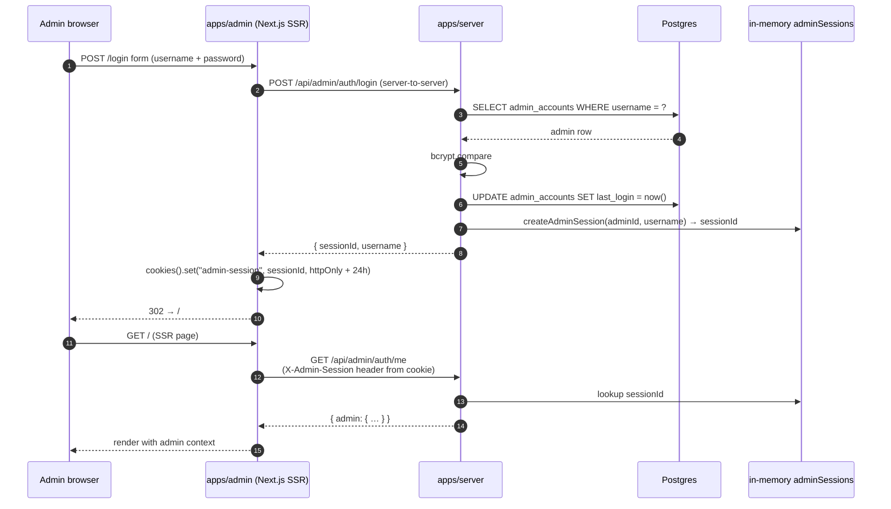

# Sequence — Auth flows

Two parallel auth systems share the API server but never touch each other's state.

## User (employee / manager) login

## Admin login

## Trade-offs

- **Why two systems?** Admin needs a different cookie scope and shorter
  audit-friendly trail (we keep `admin_accounts.last_login`). Reusing JWT
  would force a single secret across two security boundaries.
- **Why in-memory admin sessions?** A small set (~5 admins) makes a Map cheap
  and avoids a Redis round-trip on every request. Trade-off: server restart
  invalidates active admin sessions. Acceptable for MVP; multi-pod would
  require a Redis-backed session adapter (Phase 2).
