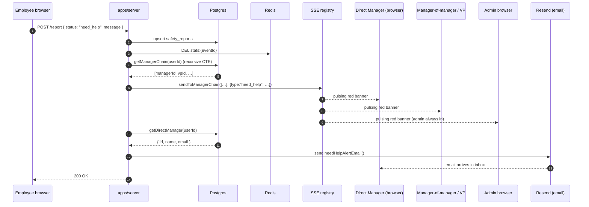

# Sequence — Employee marks 「需要協助」 (need_help)

Notes:

- The SSE fan-out reaches **every** manager up the chain plus all online
  admins — so a senior VP can step in if the direct manager is offline.
- Email is best-effort and rate-limited (max 3 per (event, user) via a Redis
  counter with 8h TTL) — see `reminder-cron.md`.
- The banner client-side is dismissible per-alert.
