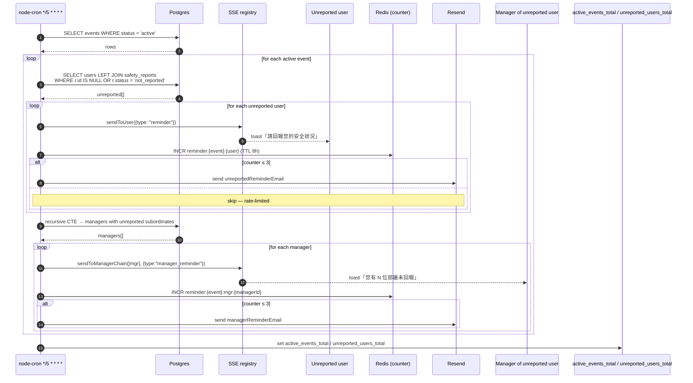

# Sequence — Auto-reminder cron job (every 5 minutes)

Why this design:

- The recursive CTE is computed **once per event** in a single SQL, returning
  managers + their unreported subordinate count grouped.
- The Redis counter caps the email volume so an unanswered user never gets
  spammed beyond 3 messages. SSE reminders keep firing as long as the user is
  online.
- The Prometheus gauges set at the end of every tick make the cron visible in
  Grafana (`active_events_total`, `unreported_users_total`).
- Cron is disabled in test runs via `REMINDER_JOB_DISABLED=1` so suites stay
  deterministic.
