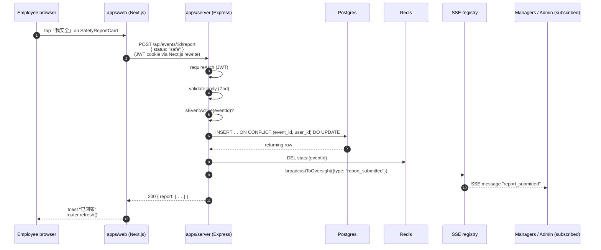

# Sequence — Employee submits a safety report

Why this design:

- The upsert is a **single SQL** — atomic at the database level, no race
  between two concurrent reports from the same user.
- Cache invalidation is fire-and-forget; on next read, the stats endpoint
  recomputes within ~30ms for a 5k-user event.
- SSE fan-out happens after the response is sent — the user doesn't wait for
  managers to receive the update.
