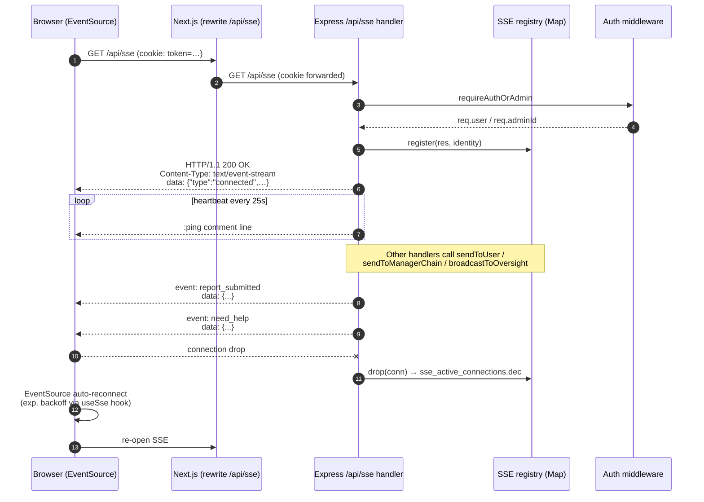

# Sequence — SSE connection lifecycle

Notes:

- The heartbeat is a comment line (`:ping\n\n`) — visible only to keep proxies
  like nginx and Cloudflare from closing idle connections.
- The discriminated union `SseEvent` is defined in
  `@workspace/api-contracts/src/sse.ts`; both server and client parse with
  `sseEventSchema` so any drift is a type error.
- Connection registry is in-memory per server pod. For multi-pod scale, a
  Redis pub/sub bridge would relay events between pods (Phase 2).
